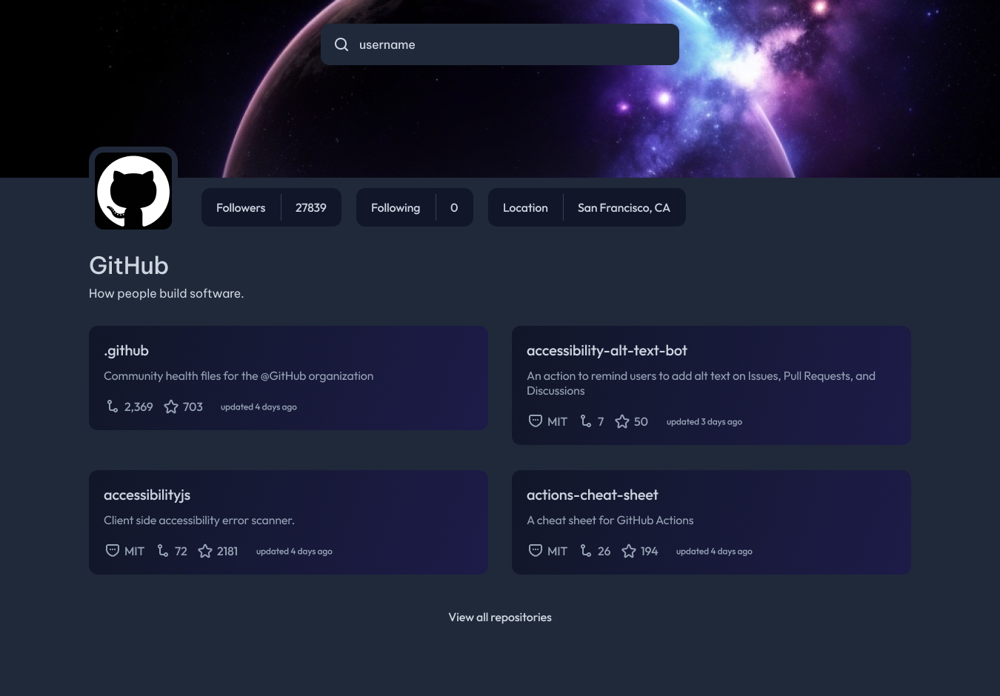

<div align="center">

# GitHub Profile


El desafío requiere crear una aplicación de búsqueda de Perfil de Github que utiliza múltiples endpoints de API. La aplicación de búsqueda de Perfil de Github requiere el uso de múltiples APIs, como la API REST de Github, que devuelve información sobre un repositorio como JSON.

</div>

<details>
<summary>Tabla de contenidos</summary>

- [GitHub Profile](#github-profile)
  - [Diseño](#diseño)
    - [Dónde encontrar todo](#dónde-encontrar-todo)
  - [Stack Tecnológico](#stack-tecnológico)
  - [Detalles Técnicos](#detalles-técnicos)
    - [Instrucciones para Usar una Librería Frontend](#instrucciones-para-usar-una-librería-frontend)

</details>

## Diseño




### Dónde encontrar todo

Tu objetivo es construir el proyecto usando el diseño proporcionado. Puedes encontrar los diseños en el editor del desafío una vez que inicies el desafío o en la carpeta /design. Ten en cuenta que la carpeta /design puede no incluir todos los diseños que necesitas, así que asegúrate de revisar el editor para más detalles.
Los diseños están en formato JPG, por lo que necesitarás usar tu mejor juicio para estilos como font-size, padding y margin. Además, hay guías de espaciado disponibles para cada desafío, pero el acceso a ellas requiere una membresía Pro. Con una membresía Pro, también puedes descargar los archivos de diseño de Figma.
Todos los recursos necesarios se pueden encontrar en la carpeta /resources. Es posible que necesites optimizar los recursos según sea necesario.

## Stack Tecnológico

Para este proyecto, tienes la flexibilidad de usar HTML, CSS y JavaScript o una librería Frontend como React, Vue, etc. Considera la curva de aprendizaje y la configuración adicional requerida al elegir una librería.

## Detalles Técnicos

Para obtener información del perfil de Github, puedes usar la API REST de Github. Esta API devuelve información sobre un repositorio como JSON. Puedes utilizar esta API para obtener los datos necesarios para tu aplicación de búsqueda de Perfil de Github:

> Servidores de API: https://api.github.com

Por ejemplo, puedes obtener un perfil de GitHub usando fetch:

```javascript
fetch('https://api.github.com/users/:username')
  .then((response) => response.json())
  .then((data) => {
    console.log(data)
  })
  .catch((error) => {
    console.log(error)
  })
```

### Instrucciones para Usar una Librería Frontend

Si eliges usar una librería frontend como React, Vue o Svelte para este proyecto, sigue estas instrucciones adicionales:

1. Configurar la Librería Frontend:
   Instala las dependencias necesarias para la librería de tu elección. Por ejemplo, si estás usando React, puedes usar Create React App para configurar un nuevo proyecto de React.
   Sigue la documentación de la librería para configurar tu proyecto correctamente.
2. Crear Componentes:
   Usa el sistema de componentes de la librería para crear componentes reutilizables para el campo de entrada, visualización de perfil y lista de repositorios.
   Organiza tus componentes en una estructura de carpetas lógica.
3. Obtener Datos del Perfil de GitHub:
   Utiliza el cliente HTTP integrado de la librería o una librería de terceros (como Axios) para hacer solicitudes API a la API de GitHub basándose en el nombre de usuario ingresado.
   Maneja la respuesta de la API y actualiza el estado del componente en consecuencia.
4. Manejar Estado:
   Usa el sistema de gestión de estado de la librería (como los hooks useState y useEffect de React) para manejar estado y efectos secundarios.
   Actualiza el estado del componente cuando sea necesario, como al obtener datos del perfil o manejar interacciones del usuario.
5. Mostrar Información del Perfil:
   Renderiza la información del perfil del usuario, incluyendo seguidores, siguiendo, ubicación y repositorios, usando la sintaxis de plantillas o JSX de la librería.

```javascript
import React, { useState, useEffect } from 'react'
import axios from 'axios'

function App() {
  const [username, setUsername] = useState('')
  const [profile, setProfile] = useState(null)
  const [repos, setRepos] = useState([])

  const fetchProfile = async () => {
    // Obtener perfiles y establecer valores correctos
  }

  // Renderizar tus componentes
  return <div></div>
}

export default App
```
